# 技术说明

## 分层结构
- UI：`MainApp.m` 负责布局、事件绑定与显示更新。
- UI 管理：`+UI/PanelManager.m` 负责参数/知识点/日志面板的读写。
- UI 布局：`+UI/PanelLayout.m` 统一控制模板面板的显示/隐藏。
- Controller：`+Control/AppController.m` 负责状态机、定时器与日志调度。
- Engine：`+Engine/ParticleEngine.m` 负责粒子运动解析更新。
- Physics：`+Physics/Lorentz.m` 提供洛伦兹力与反解工具。
- 参数 Schema：`+Control/ParamSchema.m` 统一默认参数、归一化与校验。
- 参数校验：`+Control/ParamValidator.m` 负责模板级优先策略与范围约束。
- 单位工具：`+Control/UnitUtil.m` 负责 UI <-> SI 转换与数字格式化。
- Viz：`+Viz/SceneRenderer.m` 统一场景句柄与显示样式。
- 场景控制：`+Services/SceneController.m` 负责场景渲染与装饰更新。
- 场景引擎渲染：`+Services/SceneEngineRenderer.m` 负责分引擎的场景更新实现。
- 曲线控制：`+Services/PlotController.m` 负责曲线绘制与缓存更新。
- 同步控制：`+Services/SyncController.m` 负责控制器回调与参数同步。
- UI 控制：`+Services/UiController.m` 为薄门面；模板相关逻辑位于 `+Services/TemplateUiController.m`，参数/单位/速度回调位于 `+Services/ParamUiController.m`。
- Logger：`+Logger/LogStore.m` 负责结构化日志存储。

## 目录结构概览
- `MainApp.m`：主入口，负责 UI 创建、模板切换、参数同步与渲染。
- `app/`：`.mlapp` 存档（App Designer），不可直接编辑。
- `+Config/`：模板目录与注册表（`TeachingCatalog`/`TemplateRegistry`）及模板函数。
- `+Control/`：控制器、参数 Schema/校验、单位换算。
- `+Engine/`：物理引擎实现（粒子/交叉场/质谱/安培力）。
- `+UI/`：面板读写适配、动态控件构建、面板显示布局。
- `+Viz/`：场景渲染与显示开关。
- `+Physics/`：基础物理公式工具。
- `+Logger/`：日志存储。
- `+Services/`：跨模块服务（模板加载、日志导出等）。
- `docs/`：技术文档与教学目录说明。

## 文件关系图

```mermaid
flowchart TD
  MainApp[MainApp.m] --> PanelBuilder[+UI/PanelBuilder.m]
  MainApp --> PanelManager[+UI/PanelManager.m]
  MainApp --> PanelLayout[+UI/PanelLayout.m]
  MainApp --> TemplateService[+Services/TemplateService.m]
  MainApp --> LogService[+Services/LogService.m]
  MainApp --> TeachingCatalog[+Config/TeachingCatalog.m]
  MainApp --> TemplateRegistry[+Config/TemplateRegistry.m]
  TemplateRegistry --> Templates[+Config/+templates/*.m]

  MainApp --> ParamSchema[+Control/ParamSchema.m]
  MainApp --> AppController[+Control/AppController.m]
  AppController --> ParamValidator[+Control/ParamValidator.m]
  ParamValidator --> TemplateRegistry

  AppController --> Engine[+Engine/*Engine.m]
  Engine --> State[state struct]
  AppController --> Logger[+Logger/LogStore.m]
  AppController --> Physics[+Physics/Lorentz.m]

  AppController -->|onRender| MainApp
  MainApp --> SceneController[+Services/SceneController.m]
  SceneController --> SceneEngineRenderer[+Services/SceneEngineRenderer.m]
  MainApp --> PlotController[+Services/PlotController.m]
  MainApp --> SyncController[+Services/SyncController.m]
  MainApp --> UiController[+Services/UiController.m]
  UiController --> TemplateUiController[+Services/TemplateUiController.m]
  UiController --> ParamUiController[+Services/ParamUiController.m]
  SceneController --> SceneRenderer[+Viz/SceneRenderer.m]

  PanelManager --> PanelParticle[+UI/PanelParticle.m]
  PanelManager --> PanelCrossed[+UI/PanelCrossed.m]
  PanelManager --> PanelMassSpec[+UI/PanelMassSpec.m]
  PanelManager --> PanelAmpere[+UI/PanelAmpere.m]
  PanelParticle --> UnitUtil[+Control/UnitUtil.m]
```

## 拓展性与重构评估
- 拓展性：中等偏好。新增模板通常需要同时改 `TeachingCatalog`、`TemplateRegistry`、`+Config/+templates`，并按需新增 Engine/Panel/Layout/Scene 标题逻辑。
- 重构复杂度：中等偏高。`MainApp.m` 汇集了 UI、渲染、回调与部分业务逻辑，牵涉面广；好处是分层已存在（Control/Engine/UI/Viz/Config），可逐步抽离而不必一次性大改。

## 匀强磁场解析更新
- 速度向量按角频率 `w = qB/m` 做解析旋转。
- 位置由旋转速度积分得到解析位移。
- 有界磁场通过二分法估算出界时刻，出界后转为匀速直线。
- 初始位置由 `x0/y0` 控制（未设置时默认使用边界中心）。

## UI 动态控件（方案 C）
- 目的：当 AppDesigner 未包含参数/知识点/日志控件时，运行期自动补齐。
- 入口：`UI.PanelBuilder.ensureAll(app)`，已在 `startupFcn` 中调用。
- 绑定方式：动态创建的控件直接绑定 `app.handleParamsChanged()`/`app.handleViewChanged()`。
- 前置条件：`MainApp` 需保留对应句柄属性（可通过自定义 `properties` 预留），且 `ParamTab/KnowledgeTab/LogTab` 必须存在。
- 约束：仅做 UI 构建与布局，不涉及物理计算与仿真推进。
- 拆分：`PanelBuilder` 拆为 `PanelBuilderCore/Particle/Templates/Knowledge`，主类仅负责聚合与通用 helper。

## MainApp 与 .mlapp 对齐
- `MainApp.m` 保持极简固定控件（与 .mlapp 一致），其余控件由 `PanelBuilder` 动态创建。
- 教学目录树若未在 .mlapp 中定义，会在运行期自动创建并绑定选择回调。

## 渲染与速度
- 定时器固定 `RenderDt = 1/30`，渲染频率稳定。
- 速度倍率仅影响 `dtSim`，不改变渲染频率。

## 日志与导出
- 日志由 `+Logger/LogStore.m` 统一存储，UI 日志区读取自 `MainApp.appendLog`。
- 支持导出为 UTF-8 文本文件：`Logger.LogStore.get().exportToFile()`。
- `MainApp` 的调试日志（`[DBG]`）同时写入 UI 与 LogStore，便于排障复现。

## 参数与单位
- `Control.ParamSchema` 是参数的唯一真源：默认值、字段完整性与轻量校验都在这里集中处理。
- `Control.UnitUtil` 负责 UI 与 SI 的转换，支持粒子单位模式（e/me）。
- `Services.UnitService` 作为业务规则层，负责粒子类型/单位模式的统一处理（q/m 常量、标签等）。
- 默认演示参数为 `q=1, m=1, B=1, v0=0.8, θ=0, x0=0, y0=0.8`，保证点击运行即可看到清晰圆周轨迹。
- 粒子单位模式下，质量基准随粒子类型切换：电子使用 `m(m_e)`，质子使用 `m(m_p)`。

## 洛伦兹力
- `Physics.Lorentz` 只做公式层计算：`F = q (E + v × B)`。
- 反解默认给出最小范数解，可选指定平行分量。

## 新增模板（M4/M5/A1）
- 速度选择器（交叉场）：`+Engine/CrossedFieldEngine.m` 用显式步进推进，场外转为匀速直线，并在出界时输出“通过/偏转”事件。
- 质谱：`+Engine/MassSpecEngine.m` 复用解析圆周更新，支持由 `T` 或 `q/m` 反推，并在状态中写入 `q/m` 与半径。
- 安培力：`+Engine/AmpereEngine.m` 支持质量与受力方向，并做简单的运动推进。

## UI 面板切换
- `MainApp` 根据模板引擎标识（`engine`）显示对应的参数/显示面板。
- `+UI/PanelManager` 只负责面板内控件的读写，速度滑块仍由 `MainApp` 维护。

## 配置与模板
- 教学目录：`+Config/TeachingCatalog.m` 只管理目录标题/分组/知识点。
- 模板注册表：`+Config/TemplateRegistry.m` 聚合 `+Config/+templates` 下的模板数据。
- 模板参数优先策略由 `+Control/ParamValidator.m` 处理（M5 当前为 `qm` 优先）。

## 目录树选择事件在 2025b 的注意事项
- 现象：点击教学目录不同模板，界面仍显示默认模板（例如一直像 M1/M2）。
- 原因：部分版本/时序下，SelectionChangedFcn 回调触发时，`app.TemplateTree.SelectedNodes` 仍可能是“上一次选中”；应优先使用事件对象 `event.SelectedNodes`。
- 处理：`MainApp.handleTemplateSelectionPublic` 已做 2025b 兼容，优先从 event 读取 SelectedNodes；目录树绑定由 `UI.PanelBuilderCore.ensureTemplateTree` 处理，并额外绑定 NodeClickedFcn 兜底。
