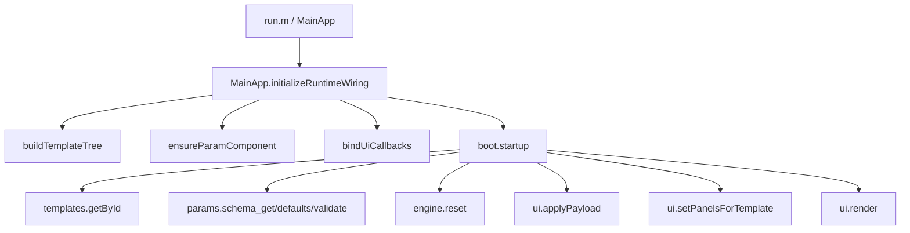

# 工程导航与运行主线

本文目标：让你在不深挖细节的前提下，先跑起来、再看懂主链路。

快速跳转：

1. 上一页：`00_索引.md`
2. 下一页：`02_模板扩展主线.md`
3. 术语表：`GLOSSARY.md`

## 1. 最小启动方式

优先使用以下任一方式：

1. MATLAB 命令行直接启动：
```matlab
cd('F:/code/matlab/EMSimLab');
addpath('apps');
addpath('src');
addpath('m');
app = MainApp;
```
2. 统一脚本启动：
```matlab
run('run.m')
```

说明：

1. 仓库真实存在 `run.m`（文件：`run.m`）。
2. `README.md` 仍提到 `run_dev.m`，但仓库中当前没有该文件，这是文档与现状不一致点。

## 2. 目录导航（学习用精简版）

```text
apps/MainApp.m                  入口与UI壳层
src/+boot/                      启动装配
src/+templates/                 模板注册与查找
src/+params/                    参数定义与校验
src/+control/                   回调控制流
src/+engine/                    状态重置与推进
src/+physics/                   物理公式函数
src/+ui/                        UI数据桥接
src/+viz/                       场景与曲线渲染
src/+logger/                    结构化日志
m/*_for_test.m                  参数组件（UI容器）
tests/smoke_*.m                 可选验证脚本
```

## 3. 启动到首帧的真实调用链



证据文件：

1. `apps/MainApp.m`：`initializeRuntimeWiring`
2. `src/+boot/startup.m`：完整首帧链路
3. `src/+ui/render.m`：渲染总入口

## 4. 播放主线（按按钮）

1. 点击“运行”：`control.onPlay`（`src/+control/onPlay.m`）
2. 进入 `app.startPlayback()`（`apps/MainApp.m`）
3. 定时器 `TimerFcn` 周期调用 `control.onTick`（`apps/MainApp.m`）
4. `onTick` 内部执行：
   1. `engine.step` 推进状态
   2. `control.mergeRailOutputs` 合并输出
   3. `ui.applyOutputs` 增量写回
   4. `ui.render` 重绘

## 5. 核心数据只看两类

1. `params`：参数结构体，定义源是 `schema_get`，合法性由 `params.validate` 统一保证。
2. `state`：运行状态结构体，由 `engine.reset/step` 产生和更新。

这也是项目现有约定“层间只流动两类核心数据”的实际落点。

## 6. 初学者先读文件顺序（精简版）

1. `run.m`
2. `apps/MainApp.m`
3. `src/+boot/startup.m`
4. `src/+templates/registry.m`
5. `src/+params/schema_get.m`
6. `src/+params/validate.m`
7. `src/+control/onTemplateChanged.m`
8. `src/+control/onParamsChanged.m`
9. `src/+engine/reset.m`
10. `src/+engine/step.m`

## 7. 先跳过哪些内容

1. `resources/project/`：MATLAB 工程元数据，对业务理解帮助小。
2. `mlapp/backup_Mainapp/`：历史备份，不是当前主链路。
3. `m/Version/`：版本快照，不参与当前接线。
4. `apps/MainApp_V1.m`：旧版本入口，当前入口是 `apps/MainApp.m`。
5. `src/+handlers/onTick.m`：占位实现，主逻辑是 `src/+control/onTick.m`。

## 8. 常见坑（入门版）

1. 路径没加 `m/`：会导致找不到 `M1_for_test`、`R2_for_test` 等参数组件。
2. 读错入口：如果从 `apps/MainApp_V1.m` 入手，会和当前主线不一致。
3. 只改 UI 不改 schema：参数会在 `params.validate` 被覆盖或回退默认。
4. 误以为 README 的 `run_dev.m` 可用：当前仓库实际是 `run.m`。

## 9. 如何扩展（导航层）

如果你只是“新增一个模板场景”，下一步直接读 `02_模板扩展主线.md`。

图示占位：

1. [占位] 启动链路截图（MainApp 初始化）
2. [占位] 播放链路截图（Timer -> onTick）
